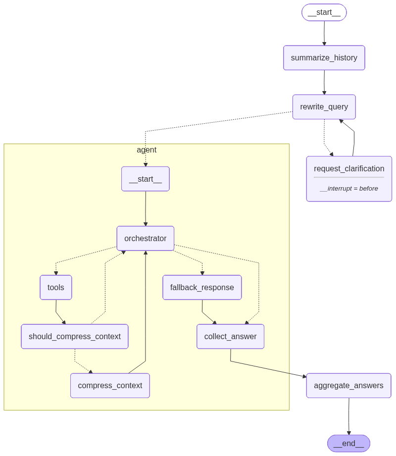

# Agentic RAG Assistant

An agentic Retrieval-Augmented Generation (RAG) assistant for querying PDF and Markdown documents through a Gradio chat interface. The system uses LangGraph to plan and control retrieval, Qdrant for local hybrid search, Ollama for local LLM inference, and optional Langfuse tracing for observability.



## Features

- Upload PDF or Markdown documents from the web UI.
- Convert PDFs to Markdown before indexing.
- Split documents into parent and child chunks for precise retrieval with richer context expansion.
- Store child chunks in a local Qdrant vector database.
- Store parent chunks as local JSON files for full-context retrieval.
- Use hybrid dense and sparse retrieval with Hugging Face embeddings and BM25 sparse vectors.
- Rewrite unclear or follow-up questions before retrieval.
- Split multi-part questions into parallel agent tasks.
- Stream tool calls, retrieval progress, and final answers in the chat UI.
- Optionally trace LangChain/LangGraph runs with Langfuse.

## How It Works

1. Documents are uploaded through the `Documents` tab.
2. PDFs are converted to Markdown, while Markdown files are copied directly.
3. The chunker creates larger parent chunks and smaller child chunks.
4. Child chunks are indexed in Qdrant for hybrid search.
5. Parent chunks are saved locally and retrieved when more context is needed.
6. User questions are summarized, analyzed, rewritten, and routed through a LangGraph agent workflow.
7. The agent searches child chunks, retrieves parent chunks, compresses long context when needed, and synthesizes a grounded answer with sources.

## Tech Stack

- Python
- Gradio
- LangChain
- LangGraph
- Ollama
- Qdrant
- Hugging Face embeddings
- PyMuPDF / PyMuPDF4LLM
- Langfuse, optional

## Project Structure

```text
.
|-- app.py                         # Application entry point
|-- config.py                      # Model, chunking, graph, and storage settings
|-- document_chunker.py            # Parent/child chunking logic
|-- utils.py                       # PDF conversion and utility helpers
|-- agentic_rag_workflow.png       # Workflow diagram used in this README
|-- core/
|   |-- rag_system.py              # RAG system initialization
|   |-- document_manager.py        # Document upload, conversion, and indexing
|   |-- chat_interface.py          # Streaming chat handler
|   `-- observability.py           # Optional Langfuse integration
|-- db/
|   |-- vector_db_manager.py       # Local Qdrant vector store manager
|   `-- parent_store_manager.py    # Parent chunk JSON store manager
|-- rag_agent/
|   |-- graph.py                   # LangGraph workflow definition
|   |-- graph_state.py             # Graph state models
|   |-- nodes.py                   # Graph node implementations
|   |-- edges.py                   # Routing logic
|   |-- prompts.py                 # Agent prompts
|   |-- schemas.py                 # Structured output schemas
|   `-- tools.py                   # Retrieval tools
|-- ui/
|   |-- gradio_app.py              # Gradio UI
|   `-- css.py                     # Custom styling
`-- assets/
    `-- chatbot_avatar.png
```

## Requirements

- Python 3.10 or newer
- Ollama installed and running locally
- The Ollama model configured in `config.py`

The default model is:

```python
LLM_MODEL = "qwen3:4b-instruct-2507-q4_K_M"
```

Make sure this model is available in Ollama, or change `LLM_MODEL` in `config.py` to a model you have installed.

## Installation

Create and activate a virtual environment:

```bash
python -m venv .venv
.venv\Scripts\activate
```

Install the required packages:

```bash
pip install python-dotenv gradio langchain-core langchain-ollama langchain-text-splitters langchain-huggingface langchain-qdrant langgraph qdrant-client sentence-transformers fastembed pymupdf pymupdf4llm tiktoken pydantic
```

Optional, for Langfuse tracing:

```bash
pip install langfuse
```

Install or pull your Ollama model:

```bash
ollama pull qwen3:4b-instruct-2507-q4_K_M
```

If you use a different local model, update `LLM_MODEL` in `config.py`.

## Environment Variables

Copy the example environment file:

```bash
copy .env.example .env
```

Langfuse is disabled by default:

```env
LANGFUSE_ENABLED=false
LANGFUSE_PUBLIC_KEY=pk-lf-...
LANGFUSE_SECRET_KEY=sk-lf-...
LANGFUSE_BASE_URL=http://localhost:3000
```

To enable tracing, set `LANGFUSE_ENABLED=true` and provide valid Langfuse credentials.

## Running the App

Start Ollama first:

```bash
ollama serve
```

Then run the Gradio app:

```bash
python app.py
```

Open the local URL printed by Gradio, usually:

```text
http://127.0.0.1:7860
```

## Usage

1. Open the `Documents` tab.
2. Upload one or more `.pdf` or `.md` files.
3. Click `Add Documents`.
4. Open the `Chat` tab.
5. Ask questions about the uploaded documents.

The assistant will search indexed child chunks, retrieve larger parent chunks when needed, and produce an answer grounded in the available documents.

## Configuration

Most runtime settings live in `config.py`.

Important settings include:

```python
DENSE_MODEL = "sentence-transformers/all-mpnet-base-v2"
SPARSE_MODEL = "Qdrant/bm25"
LLM_MODEL = "qwen3:4b-instruct-2507-q4_K_M"
LLM_TEMPERATURE = 0
MAX_TOOL_CALLS = 8
MAX_ITERATIONS = 10
GRAPH_RECURSION_LIMIT = 50
CHILD_CHUNK_SIZE = 500
CHILD_CHUNK_OVERLAP = 100
MIN_PARENT_SIZE = 2000
MAX_PARENT_SIZE = 4000
```

Storage paths are also configured in `config.py`:

```python
MARKDOWN_DIR = os.path.join(_BASE_DIR, "markdown_docs")
PARENT_STORE_PATH = os.path.join(_BASE_DIR, "parent_store")
QDRANT_DB_PATH = os.path.join(_BASE_DIR, "qdrant_db")
```

These directories are used for converted Markdown files, parent chunk JSON files, and the local Qdrant database.

## Notes

- Duplicate documents are skipped when a Markdown file with the same stem already exists.
- PDF uploads are converted to Markdown before chunking and indexing.
- Clearing documents from the UI removes converted Markdown files, parent chunks, and the Qdrant collection.
- Answers are constrained to retrieved document content. If the documents do not contain enough information, the assistant should say what is missing.
